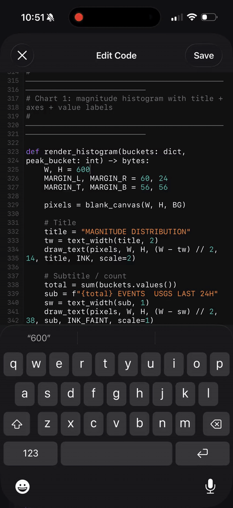

# 🌱 Terrarium

> **Embedded Python 3.13 runtime for iOS & macOS apps**, with `%pip install` magic, a SwiftUI runner sheet, and a Pyodide fallback for the scientific Python stack (matplotlib, numpy, pandas, scipy, scikit-learn).

<p align="center">
  <a href="Media/demo.mp4">
    
  </a>
  <br>
  <sub>(Tap the GIF for the higher-quality MP4)</sub>
</p>

---

## Quick start (60 seconds)

```swift
import Terrarium

// One-time, ideally at app launch
try await Terrarium.shared.initialize()

// Run any Python:
let result = await Terrarium.shared.run(code: """
    %pip install requests
    import requests
    print(requests.get("https://api.github.com/zen").text)
""")

print(result.stdout)
// → "Mind your words, they are important."
```

That's a real CPython 3.13 interpreter running in-process. No subprocess, no transpile, no JavaScript shim (for the pure-Python path). The `%pip install` line resolves a wheel from PyPI, drops it into a writable user-site-packages directory, and the next line imports it.

For matplotlib / numpy / pandas / scipy / sklearn — packages with C extensions that PyPI doesn't ship for iOS — Terrarium auto-routes through a hidden WKWebView running [Pyodide](https://pyodide.org) (CPython compiled to WebAssembly), which has pre-built WASM wheels for ~250 scientific packages.

---

## Features

| | |
|---|---|
| 🐍 **Real CPython 3.13** | Bundled via `Python.xcframework`. Pure-Python scripts run natively, fast. |
| 📦 **`%pip install <pkg>` magic** | Jupyter-style inline installs. Resolves PyPI, downloads, persists across launches. |
| 🧪 **Scientific stack via Pyodide** | `import matplotlib`/`numpy`/`pandas`/`scipy`/`sklearn` auto-routes through Pyodide's WASM runtime. |
| 📊 **Auto-rendered charts** | matplotlib figures auto-display in a View tab — no `plt.show()` ceremony required. |
| 🌐 **Real HTTPS** | `import requests` works out of the box. TLS via Python's `_ssl` module. |
| 🎨 **ANSI color support** | `rich`, `colorama`, raw escape codes all render in the runner's console. |
| 📈 **Live install progress** | Byte-level progress bars during downloads. Pip-style `\r` overwrite, not log spam. |
| ⏯️ **Run / Stop / Clear** | SwiftUI runner sheet with proper async cancellation. |
| 🗂️ **Package manager UI** | Searchable bottom sheet with per-package delete and storage size. |
| 💾 **Persistent storage** | User-installed packages survive app restarts. Delete from Settings to reclaim space. |
| 🧩 **Self-contained SwiftPM package** | All resources via `Bundle.module`. Zero manual Xcode folder references. |

---

## Example scripts

All of these are copy-pasteable into the runner.

### Hello world

```python
print("Hello from Python 3.13 on iPhone")
```

### Inline pip install

```python
%pip install humanize
import humanize
print(humanize.intcomma(1234567))   # → 1,234,567
print(humanize.naturaltime(0))      # → "a long time ago"
```

First run downloads `humanize` (~50 KB), shows a live progress bar, and persists it to disk. Second run prints `Requirement already satisfied: humanize` and proceeds instantly.

### Multiple packages on one line

```python
%pip install requests bs4 pyyaml
import requests, bs4, yaml

doc = requests.get("https://example.com").text
soup = bs4.BeautifulSoup(doc, "html.parser")
print(soup.title.text)
```

### Live API call + JSON

```python
import requests

zen = requests.get("https://api.github.com/zen").text
print(f"GitHub says: {zen}")

stars = requests.get("https://api.github.com/repos/haplollc/terrarium").json()
print(f"Terrarium has {stars.get('stargazers_count', 0)} stars")
```

### matplotlib chart (auto-rendered)

```python
%pip install matplotlib
import matplotlib.pyplot as plt

plt.plot([1, 4, 9, 16, 25], marker="o")
plt.title("Squares")
plt.xlabel("n")
plt.ylabel("n²")
plt.grid(True)
```

The chart auto-renders in the runner sheet's **View** tab. No `plt.show()` needed — Terrarium follows Jupyter's convention and savefig's any open figures after your code completes.

### Pandas data analysis

```python
%pip install pandas
import pandas as pd

df = pd.DataFrame({
    "city": ["NYC", "SF", "Tokyo", "London"],
    "population_M": [8.3, 0.87, 13.96, 9.0],
    "lat": [40.71, 37.78, 35.68, 51.51],
})
print(df.describe())
print("\nLargest city:", df.loc[df.population_M.idxmax(), "city"])
```

### Live data + chart

```python
%pip install matplotlib
import requests, matplotlib.pyplot as plt

# Fetch live earthquake data from USGS
data = requests.get(
    "https://earthquake.usgs.gov/earthquakes/feed/v1.0/summary/4.5_day.geojson",
    timeout=10
).json()

mags = [q["properties"]["mag"] for q in data["features"] if q["properties"]["mag"]]

plt.hist(mags, bins=10, edgecolor="white")
plt.title(f"{len(mags)} earthquakes ≥ M4.5 in the last 24h")
plt.xlabel("Magnitude")
plt.ylabel("Count")
```

### Rich (colored terminal output)

```python
from rich.console import Console
from rich.table import Table

console = Console()
table = Table(title="Terrarium runtimes")
table.add_column("Path", style="cyan")
table.add_column("Speed", style="green")
table.add_column("Packages", style="magenta")
table.add_row("CPython", "Native", "30+ bundled + any pure-Python from PyPI")
table.add_row("Pyodide", "WASM (~2× slower)", "~250 scientific packages")
console.print(table)
```

`rich` ships pre-bundled. Output renders with colors in the Console tab thanks to Terrarium's ANSI parser.

### Display a custom PNG

```python
import io, struct, zlib
import terrarium_show

# Generate a tiny gradient PNG from scratch
W, H = 200, 100
pixels = bytearray()
for y in range(H):
    pixels.append(0)  # PNG filter byte
    for x in range(W):
        r = int(255 * x / W)
        g = int(255 * y / H)
        b = 128
        pixels.extend([r, g, b])

def png(w, h, raw):
    def chunk(t, d):
        crc = zlib.crc32(t + d) & 0xffffffff
        return struct.pack(">I", len(d)) + t + d + struct.pack(">I", crc)
    sig = b"\x89PNG\r\n\x1a\n"
    ihdr = struct.pack(">IIBBBBB", w, h, 8, 2, 0, 0, 0)
    return sig + chunk(b"IHDR", ihdr) + chunk(b"IDAT", zlib.compress(bytes(raw))) + chunk(b"IEND", b"")

terrarium_show.show(png(W, H, pixels))
```

`terrarium_show.show()` accepts a matplotlib Figure, a PIL Image, or raw PNG/JPEG bytes — whichever you have.

### Uninstall a package

```python
%pip uninstall humanize
```

Or open Settings → Python → tap the trash icon next to the package.

### List installed packages

```python
%pip list
```

Prints a pip-style table:

```
Package    Version    Source
---------- ---------- ------
arrow      1.3.0      bundled
bs4        0.0.2      bundled
certifi    2024.7.4   bundled
humanize   4.7.1      user
matplotlib 3.8.4      pyodide
numpy      2.0.0      pyodide
requests   2.31.0     bundled
```

`source` is `bundled` (ships with Terrarium), `user` (installed via `%pip` to CPython side), or `pyodide` (installed via `%pip` to the Pyodide WASM runtime).

### Force a specific runtime

By default, Terrarium picks the runtime based on what your script imports. Override it with a magic comment at the top:

```python
# %runtime pyodide
import some_package_i_want_to_test_in_wasm
```

```python
# %runtime cpython
# Force the native interpreter even though some heuristic might pick Pyodide.
```

### `-r requirements.txt`

```python
%pip install -r requirements.txt
import data_pipeline
data_pipeline.run()
```

Standard pip flag. Reads the file, strips comments, installs each line.

---

## How `%pip install` routes

| You write | What happens |
|---|---|
| `%pip install requests` | Pure-Python wheel from PyPI → CPython side (`~/Library/Application Support/.../site-packages`). Persistent across launches. |
| `%pip install numpy` | Native-extension package → Pyodide side (`micropip` over jsDelivr CDN). Cached in IndexedDB. |
| `%pip install matplotlib` | Same as numpy. Auto-pulls deps: `numpy`, `Pillow`, `contourpy`, `kiwisolver`, `fonttools`, `cycler`, etc. |
| `%pip install some-random-pkg` | Tries CPython first; auto-falls-back to Pyodide if the wheel needs native extensions. |
| `%pip install requests==2.31.0` | Version specifier is stripped today (latest installed). Pinning support is on the roadmap. |

---

## Installation

### 1. Fetch `Python.xcframework`

Terrarium needs the CPython runtime (~112 MB binary). It's gitignored — run the setup script once:

```bash
git clone https://github.com/haplollc/terrarium
cd terrarium
./Scripts/setup-python.sh
```

This pulls the iOS arm64 build from [BeeWare's Python-Apple-support](https://github.com/beeware/Python-Apple-support).

### 2. Add as a SwiftPM dependency

In Xcode: **File → Add Package Dependencies** → `https://github.com/haplollc/terrarium`

Or in `Package.swift`:

```swift
dependencies: [
    .package(url: "https://github.com/haplollc/terrarium", from: "1.0.0"),
],
targets: [
    .target(name: "MyApp", dependencies: ["Terrarium"]),
],
```

### 3. Build and use

```swift
import Terrarium

@main
struct MyApp: App {
    init() {
        Task { try? await Terrarium.shared.initialize() }
    }
    var body: some Scene { … }
}
```

**That's it.** No folder references to add. No SwiftPM resource declarations. `Bundle.module` inside the package has everything: `python-stdlib`, `site-packages`, `lib-dynload`, `pyodide-host`. The package handles its own resource layout.

---

## API

### `Terrarium.shared`

The singleton entry point. `@MainActor`-isolated.

#### `run(code: String, timeout: TimeInterval = 30, onProgress: ProgressCallback? = nil) async -> PythonRunResult`

Run a Python script. Returns a `PythonRunResult` with `stdout`, `stderr`, `exception`, `exitCode`, `durationMs`, and `isSuccess`.

```swift
let result = await Terrarium.shared.run(
    code: pythonCode,
    onProgress: { line in
        // Streamed live as `%pip` runs — terminal-style carriage
        // returns are honored, so progress bars overwrite in place
        // instead of spamming the buffer.
        print(line, terminator: "")
    }
)
```

#### `stop()`

Cancel the in-flight run. Returns control to `.idle` immediately. Whether Python itself halts depends on whether your script is at a yield point.

### `PythonCodeRunnerSheet`

Drop-in SwiftUI sheet view with Run/Stop/Clear toolbar, segmented Console/View tabs, live install progress, ANSI color rendering, and auto-display for matplotlib figures.

```swift
.sheet(item: $codeToRun) { code in
    PythonCodeRunnerSheet(code: code.value)
        .presentationDetents([.medium, .large])
        .presentationDragIndicator(.visible)
}
```

### `PythonPackageManagerView`

Searchable bottom sheet listing all installed packages (CPython + Pyodide) with per-package size, install date, and a trash icon.

```swift
.sheet(isPresented: $showingPackages) {
    PythonPackageManagerView()
        .presentationDetents([.medium, .large])
        .presentationDragIndicator(.visible)
}
```

### `terrarium_show` (Python module)

Pre-installed Python module for displaying images in the runner's View tab.

```python
import terrarium_show

terrarium_show.show(matplotlib_figure)   # auto-detected
terrarium_show.show(pil_image)
terrarium_show.show(png_or_jpeg_bytes)
```

You usually don't need this for matplotlib — Terrarium auto-renders open figures after each run. Use it explicitly for non-matplotlib images.

---

## Architecture

```
┌─────────────────────────────────────────────────────────────┐
│  Terrarium (Swift, @MainActor)                              │
│    └── run(code:) → scan for %pip + native imports          │
│                       │                                      │
│         ┌─────────────┴─────────────┐                       │
│         ▼                            ▼                       │
│   PythonRuntimeService        PyodideBridge                  │
│   (CPython.xcframework         (hidden WKWebView,            │
│    in-process)                  Pyodide WASM from CDN,       │
│                                  IDBFS persistent fs)        │
│                                                              │
│   pure-Python only            numpy / pandas / scipy /       │
│   (requests, bs4, etc.)        matplotlib / sklearn / …      │
└─────────────────────────────────────────────────────────────┘
```

### Where things live at runtime

- **CPython user-installed packages**: `~/Library/Application Support/<bundle>/python/site-packages/` — persists across launches, deletes when the app is uninstalled.
- **Pyodide-installed packages**: IndexedDB inside the hidden WebView's persistent data store. The bridge mounts an IDBFS-backed FS at `/persist` and `sync()`s after every install/uninstall.
- **Bundled Python stdlib + 30 default packages**: Inside the `Terrarium_Terrarium.bundle/` SwiftPM resource bundle — auto-located via `Bundle.module`.

### Resource bundle layout

```
Terrarium_Terrarium.bundle/
├── python-stdlib/            (47 MB — CPython 3.13 standard library)
├── site-packages/            (13 MB — curated pure-Python packages)
├── lib-dynload/              (14 MB — C extension shims)
└── pyodide-host/             (small — host.html + JS bridge)
```

---

## Limitations

- **iOS / macOS only.** No Linux, no Windows, no Android.
- **iOS 17+ / macOS 14+.** The package manager UI uses `ContentUnavailableView`, an iOS 17 / macOS 14 API.
- **Pyodide is ~2-3× slower than CPython** for pure-Python loops. Roughly equivalent on numpy-heavy code (the inner C is still vectorized inside WASM).
- **First Pyodide boot is ~2-4 seconds.** The bridge boots eagerly on app startup to hide this from the user's first install.
- **First package install needs network.** Pyodide downloads from jsDelivr's CDN on first import. Subsequent runs are offline.
- **No JIT.** Both runtimes use standard CPython. PyPy-style speedups aren't on the table.
- **Some Pyodide-incompatible packages** (anything depending on tkinter, iOS system frameworks, or PyPy specifics) won't install via the Pyodide path either. Most of the scientific Python ecosystem works.

---

## License

[MIT](LICENSE) for our code. Bundled third-party code retains its original license:

- Python 3.13 standard library — [PSF License Agreement](https://docs.python.org/3/license.html)
- Bundled pure-Python packages — see each package's metadata
- Pyodide — [MPL 2.0](https://github.com/pyodide/pyodide/blob/main/LICENSE)

---

## Credits

Built by [Haplo](https://haploapp.com). Stands on the shoulders of:

- [BeeWare](https://beeware.org/) — `Python-Apple-support` ships the `Python.xcframework` we link against.
- [Pyodide](https://pyodide.org/) — CPython compiled to WebAssembly + ~250 pre-built WASM wheels.
- [ZIPFoundation](https://github.com/weichsel/ZIPFoundation) — wheel extraction.
